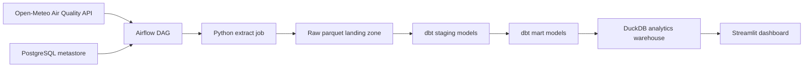

# Bangkok AQI Pipeline

This project is a portfolio-ready data engineering capstone focused on collecting, modeling, and serving Bangkok air quality data. The repository is structured around a clear split: Airflow orchestrates the pipeline, Python handles ingestion, dbt handles transformation, PostgreSQL stores Airflow's metadata, and DuckDB remains the analytics warehouse.

## Architecture



## Project Structure

```text
.
|-- dashboard/               # Streamlit app entrypoint
|-- dbt/                     # dbt project for staging and marts
|-- dags/                    # Airflow DAGs
|-- data/raw/                # local raw landing zone (gitignored)
|-- airflow/                 # Airflow image assets and logs
|-- src/bangkok_aqi/         # Python package for extraction and storage
|-- tests/                   # unit tests for ingestion helpers
|-- warehouse/               # DuckDB outputs (gitignored)
|-- docker-compose.yml       # local Airflow + PostgreSQL stack
|-- Dockerfile               # containerized extract entrypoint
|-- Makefile                 # common developer commands
|-- pyproject.toml           # project metadata and dependencies
```

## Why This Shape

- Airflow owns orchestration and scheduling.
- Python remains responsible for API integration, retries, configuration, and raw data persistence.
- dbt owns type casting, column naming, testing, and the final analytics model.
- PostgreSQL is only used for Airflow's metastore.
- Raw data is append-only and partitioned by ingestion date so the project keeps history instead of rewriting a single file.
- DuckDB stays in place because this repo is still single-user analytics, not a multi-user serving layer.

## Quickstart

```bash
python3 -m venv .venv
source .venv/bin/activate
python -m pip install -e ".[dev]"
cp .env.example .env
```

Run the ingestion job:

```bash
make extract
```

Build the warehouse with dbt:

```bash
dbt build --project-dir dbt --profiles-dir dbt
```

Run tests:

```bash
make test
```

Launch the dashboard:

```bash
make dashboard
```

Run Airflow locally:

```bash
docker compose up airflow-init
docker compose up -d airflow-webserver airflow-scheduler
```

Airflow UI:

```text
http://localhost:8080
```

## Current Scope

This first pass sets up a clean project foundation for a capstone:

- local Airflow orchestration with PostgreSQL metadata
- package-based Python ingestion
- dbt project scaffold for transformations
- DuckDB warehouse output under `warehouse/`
- Streamlit dashboard over the AQI mart
- repo cleanup and gitignore strategy
- basic unit tests and developer commands

## Recommended Next Steps

1. Add data quality monitoring and run alerts.
2. Add a second dataset for enrichment to make the capstone less one-dimensional.
3. Replace the legacy Azure deployment script with a batch-oriented deployment path.
