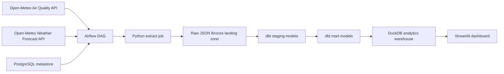

# Bangkok AQI Pipeline

This project is a portfolio-ready data engineering capstone focused on collecting, modeling, and serving Bangkok air quality data. The repository is structured around a clear split: Airflow orchestrates the pipeline, Python handles ingestion, dbt handles transformation, PostgreSQL stores Airflow's metadata, and DuckDB remains the analytics warehouse.

The current version includes validation at both ingestion time and warehouse build time so malformed API payloads fail fast instead of quietly reaching the dashboard.
It also supports optional failure alerts through a webhook so broken Airflow tasks and dbt runs can notify you automatically.
AQI forecasts are now enriched with a second hourly weather dataset so downstream analysis can compare pollution with temperature, humidity, and wind conditions.

## Architecture



## Project Structure

```text
.
|-- dashboard/               # Streamlit app entrypoint
|-- dbt/                     # dbt project for staging and marts
|-- dags/                    # Airflow DAGs
|-- data/raw/                # local raw landing zone (gitignored)
|-- airflow/                 # Airflow image assets and logs
|-- src/bangkok_aqi/         # Python package for extraction and storage
|-- tests/                   # unit tests for ingestion helpers
|-- warehouse/               # DuckDB outputs (gitignored)
|-- docker-compose.yml       # local Airflow + PostgreSQL stack
|-- Dockerfile               # containerized extract entrypoint
|-- Makefile                 # common developer commands
|-- pyproject.toml           # project metadata and dependencies
```

## Why This Shape

- Airflow owns orchestration and scheduling.
- Python remains responsible for API integration, retries, configuration, and raw data persistence.
- dbt owns type casting, column naming, quality assertions, and the final analytics model.
- PostgreSQL is only used for Airflow's metastore.
- Raw JSON Bronze data is append-only and partitioned by ingestion date so the project keeps history instead of rewriting a single file.
- DuckDB stays in place because this repo is still single-user analytics, not a multi-user serving layer.

## Data Quality Guardrails

- The extract job validates that the hourly payload contains the expected AQI fields, non-empty rows, parseable timestamps, and at least one populated metric before writing raw JSON.
- The enrichment extract also validates weather timestamps and required fields before landing the second dataset.
- dbt tests assert key metadata fields, accepted source-system values, non-negative particulate metrics, AQI values within expected bounds, and contiguous hourly coverage in the mart.
- Airflow surfaces payload validation failures as explicit task failures so bad upstream data is visible in orchestration instead of looking like a generic shell error.

## Quickstart

```bash
python3 -m venv .venv
source .venv/bin/activate
python -m pip install -e ".[dev]"
cp .env.example .env
```

To enable failure alerts, set `ALERT_WEBHOOK_URL` in `.env` to an incoming webhook endpoint that accepts a JSON payload shaped like `{"text": "..."}`.

Run the ingestion job:

```bash
make extract
```

Build the warehouse with dbt:

```bash
dbt build --project-dir dbt --profiles-dir dbt
```

Run tests:

```bash
make test
```

Launch the dashboard:

```bash
make dashboard
```

Deploy the batch extract job to Azure Container Apps Jobs:

```bash
make deploy-azure-job
```

Run Airflow locally:

```bash
docker compose up airflow-init
docker compose up -d airflow-webserver airflow-scheduler
```

Airflow UI:

```text
http://localhost:8080
```

If the extract task or the dbt build task fails inside Airflow, the DAG will post a failure message to the configured webhook.

## Azure Batch Deployment

- [`deploy_azure.sh`](/Users/potangpa/bangkok-aqi-pipeline/deploy_azure.sh) now provisions an Azure Container Apps Job instead of a long-lived public Container App.
- The deployment flow creates a resource group, blob storage, ACR, a Container Apps environment, and a scheduled or manual batch job for `python -m bangkok_aqi.cli extract`.
- Override settings with environment variables such as `RESOURCE_GROUP`, `LOCATION`, `JOB_TRIGGER_TYPE`, `JOB_CRON_SCHEDULE`, and `ALERT_WEBHOOK_URL` before running the script.
- Use `JOB_TRIGGER_TYPE=Manual make deploy-azure-job` if you want an on-demand job instead of the default hourly schedule.

## Current Scope

This first pass sets up a clean project foundation for a capstone:

- local Airflow orchestration with PostgreSQL metadata
- package-based Python ingestion for AQI and weather data
- extract-time payload validation before raw data is persisted
- dbt transformations with mart-level data quality assertions
- AQI mart enrichment with temperature, humidity, and wind speed forecasts
- Azure batch deployment path for scheduled cloud extraction
- DuckDB warehouse output under `warehouse/`
- Streamlit dashboard over the AQI mart
- repo cleanup and gitignore strategy
- unit tests and developer commands

## Recommended Next Steps

1. Add delivery-specific alert formatting and routing so failures can target Slack, Teams, or email cleanly.
2. Add a third dataset, such as traffic or wildfire data, to make the capstone less one-dimensional.
3. Persist warehouse artifacts in cloud storage or move transforms to a cloud-native warehouse path instead of local DuckDB only.
